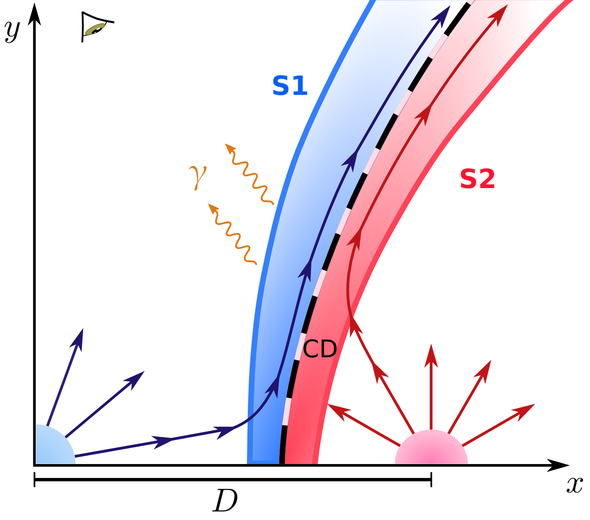
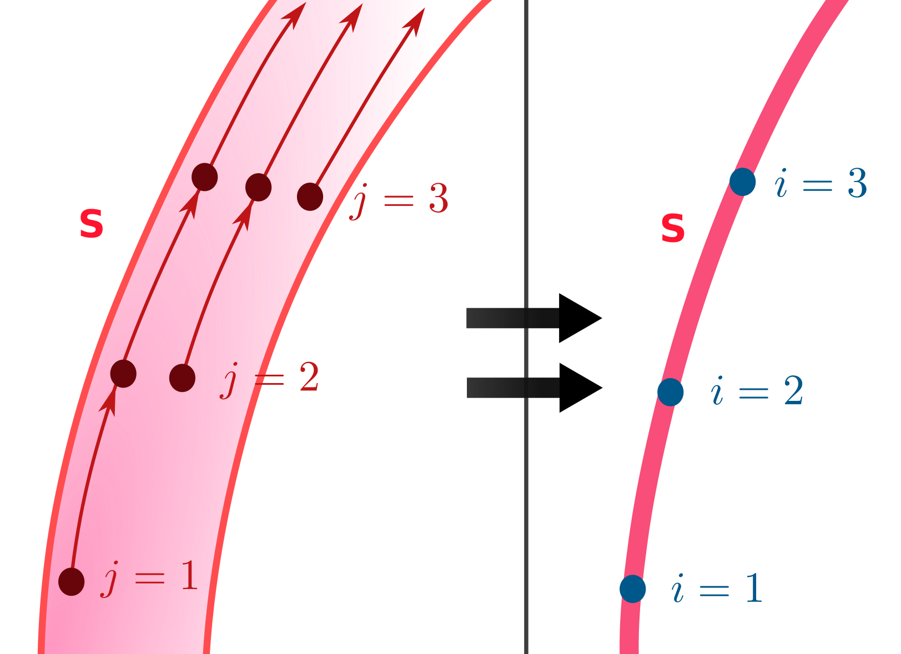

# CWB Non-thermal Emission

Software to compute the non-thermal emission model from a colliding-wind binary (CWB). 

## Model summary

The wind-collision region (WCR) is treated as an axisymmetric 2-D shell in which the shocked winds flow in a laminar regime. The thermodynamic quantities at each shock (one for each stellar wind) are calculated using analytical prescriptions. Relativistic particles are assumed to accelerate at the adiabatic shocks in the WCR. These particles emit radiation as they move with the flow via various processes (synchrotron, relativistic bremsstrahlung, inverse-Compton scattering, proton-proton collisions). The emission can be absorbed by the stellar winds (free-free absorption) or by the stellar photon fields (gamma-gamma absorption).

Besides system-specific parameters, the model has two free parameters that have a strong impact in the non-thermal output: the fraction between magnetic and thermal pressure (`eta_mag`) and the fraction of the available wind kinetic power that is transferred to relativistic particles (`f_NT`).

| &nbsp;&nbsp;&nbsp;&nbsp; | &nbsp;&nbsp;&nbsp;&nbsp; |
| :---: | :---: |
| &nbsp; | &nbsp; |

*Sketch of the model geometry (left) and the relativistic particle transport (right). Reproduced from del Palacio et al. (2016) and del Palacio et al. (2021) (ADS link: https://ui.adsabs.harvard.edu/abs/2021BAAA...62..246D/abstract)*

For additional details of the model we refer to del Palacio, S., et al. 2016, A&A, 591, 139 (ADS link: https://ui.adsabs.harvard.edu/abs/2016A%26A...591A.139D/abstract). 


## Code usage 

The modular code is written in Fortran 90, compiled with *Make*, and run as `./run.x`. The default build uses BLAS and LAPACK. Runtime-generated data files are written to `output/`. The tracked root-level `gauntff.dat` is a fixed input table required for free-free processes; it is never generated or overwritten by the build. This table was downloaded externally from van Hoof et al. (2014), MNRAS, 444, 420 (ADS link: https://ui.adsabs.harvard.edu/abs/2014MNRAS.444..420V/abstract). Generated files can be safely removed using `make clean`. Additional python and gnuplot scripts are provided to make diagnostic and publication-ready plots. 

The code is partially parallelized with OpenMP. Local benchmarking shows an approximately 1.5x speedup for the default four-thread setup (`nth=4` in `global.f90`); increasing to 8 threads does not provide additional speedup. Note: Parallel and serial runs were additionally compared using SHA-256 hashes of the generated output files and produced identical results for the validation cases.

The default configuration uses a single reference epoch and the parameter values in `system_parameters.f90`. The code provides a command to reproduce the scientific results for the Apep system presented in del Palacio et al. 2026 (submitted). Some further details of each code are given below.


## Important files

**Makefile**: instructions for compiling using *make*

**Makefile.depend**: details which modules depend on which other modules (needed for compilation)

**constants.f90**: useful physical and numerical constants. It is imported by **global.f90** to be used by all other modules as well.

**system_parameters.f90**: parameters of the specific system being studied. It is imported by **global.f90** to be used by all other modules as well.

**global.f90**: constants, variables and number of points in the simulation to be used by all other modules.

**controls.f90**: this sets which modules are going to run in the simulation by setting variables to *on* or *off*.

**orbit.f90**: calculates the relative star positions for either the reference epoch (`single_epoch=on`) or the placeholder multi-epoch path. The single-epoch mode uses the configured reference parameters; the multi-epoch option is under development.

**CD.f90**: calculates the position of the contact discontinuity (CD). The extended emitter is assumed to be made up of emission cells at these same positions (for both shocks, S1 and S2; see sketch). 

**CD_rot.f90**: reads the `x` `y` coordinates from `output/CD.dat` (upper half of the CD), reconstructs the lower half, rotates the whole branch, and stores the result in the global `x`, `y`, `z` arrays. 

**CD_thermo.f90**: calculates the thermodynamical quantities at each position along the CD.

**CD_dist_(i).f90**: calculates the non-thermal particle (e=electron, p=proton) population at each position of the CD -for each shock- and saves it in a plain text file.

**CD_rad(XX).f90**: calculates the SED by the respective process reading the corresponding non-thermal particle population from the file generated by **dist_(i).f90**.

**CD_abssyn.f90**: applies free-free absorption by the stellar winds to the synchrotron emission from the WCR, and produces the absorbed radio SED and emission maps.

**opac_ff.f90**: calculates the free-free opacity and thermal emission of the stellar winds over the required radio frequencies and viewing angles.

**opac_gg.f90**: calculates the gamma-gamma pair-production opacity of the stellar radiation fields for high-energy photons.

**WCR_conv.f90**: convolves the emission map with the instrumental (synthesized) beam to compare with the observed maps.


## Additional folders

**gnuplot_scripts/**: plotting scripts. Run them from this directory; generated model data is under `../output/` and observational or instrument-sensitivity tables are under `../obs_data/`. Scripts use the `.gp` extension.

**obs_data/**: observational and instrument-sensitivity input tables for plotting and future analysis.

**validation/**: focused validation cases for the production routines. The `validation/free-free_absorption/` case validates the Apep free-free absorption maps and the production Gaunt-factor interpolation. It uses an analytical hyperbolic representation only to select the absorbing wind; the numerical contact discontinuity remains the underlying model geometry.

**python_scripts/**: Apep reproducibility and plotting scripts. The scripts run the default baseline check, explore `Mdot1`, plot the radio SED scan, and plot the available absorbed, beam-convolved radio maps. They write figures and scan outputs under `python_scripts/results/`. See `python_scripts/README.md` for the exact workflow. The `mean_z.py` script is used to obtain mean molecular weights, rms charge and multiplicative constants for the p-p and bremsstrahlung luminosities for a given chemical composition (i.e. not pure H).

The observational fluxes in `python_scripts/data_radio_apep.dat` combine measurements published in the literature and others presented in del Palacio et al. (2026, submitted). The published Apep radio data and model context are described in del Palacio et al. (2022), PASA, 39, e004 (ADS link: https://ui.adsabs.harvard.edu/abs/2022PASA...39....4D/abstract). 


## Configuration workflow

The run configuration is divided into three files:

- **controls.f90**: selects which calculation modules are executed.
- **global.f90**: defines global run variables and numerical resolutions, such as the number of spatial and energy points.
- **system_parameters.f90**: defines the physical parameters of the system being modeled.

When modeling a different system, normally only `system_parameters.f90` needs to be changed. System-specific copies can be kept in separate folders.

Before a run, copy the desired system file to the project root as `system_parameters.f90`. The active `controls.f90` and `global.f90` should normally remain unchanged. The frozen regression configuration under `tests/cases/default/` is independent of the active system configuration.


## Regression test

Run `make test-unit` to check the reusable numerical routines `vector_log` and `integrate`. Run `make test` to run these focused tests and then compile the production sources with the frozen configuration in `tests/cases/default/`, execute `run.x` in a temporary directory, and compare the numerical summary printed to the terminal with the reference values in `tests/reference_terminal_output.json`. Changes to the active study configuration do not affect this regression case; update the frozen files and reference values deliberately when the default test case changes.


## Reproduce Apep SED Results

The Apep Mdot scan requires GNU Fortran, Make, BLAS/LAPACK, Python 3, NumPy, Pandas, SciPy, and Matplotlib.

1. Run the default Apep constraint check from the project root. This first run generates the gamma-gamma tables with `absgg=on` and temporarily enables the IC controls:
   ```text
   python python_scripts/check_apep_baseline.py
   ```
   . This temporarily enables the two IC emission controls and verifies `F_10-30 keV` against `(3.9 +/- 1.2)e-13 erg/s/cm2` and `S(2GHz)` against `105-135 mJy`. The script restores the source files afterward.

2. Run the six-case Mdot exploration. The scan sets `absgg=off`, disables IC, and sets `protons=off` before running the radio-only cases:
   ```text
   python python_scripts/explore_parameter.py
   ```
   . The scan covers `Mdot1 = 1.5, 2.0, ..., 4.0` in units of
`1e-5 Msun/yr`, preserves the constant X-ray flux scaling, keeps every case,
and warns when the flux density `S(2GHz)` falls outside the range `105-135 mJy`.

3. Run `python -m python_scripts.plot_radio_seds`. The script prints the fitted ALMA-band spectral indices and writes the main result to:
   ```text
   python_scripts/results/SEDs_Mdot.pdf
   ```

4. Plot the absorbed, beam-convolved radio maps:
   ```text
   python -m python_scripts.plot_maps
   ```
   . This discovers the available `output/WCR_conv_*Gabs.dat` files and writes
   `python_scripts/results/maps_absorbed.pdf`. With the active Apep
   configuration, the default maps are generated at 2.3 and 230 GHz. The plotting
   script supports one, two, or three available map frequencies. It uses the
   beam currently configured in `WCR_conv.f90`: `sigma_x=5.6 mas` and
   `sigma_y=11.3 mas`.

The free-free and Gaunt-factor validation commands are documented in
`validation/free-free_absorption/README.md`.

## Apep Production Workflow

To reproduce the results from del Palacio et al. (2026 - submitted), run the full Apep workflow with:

```text
make apep
```

This generates the gamma-gamma tables with `absgg=on`, restores the active
Apep configuration, runs the baseline constraints, the six-case Mdot scan,
and the plotting script that produces
`python_scripts/results/SEDs_Mdot.pdf`. The absorbed map plot is run separately
with `python -m python_scripts.plot_maps`. The quick `make test` target remains
a separate sparse-grid smoke/regression test.

## Cite me

If you make use of this code, please cite:

- del Palacio et al. (2016), A&A, 591, 139: https://ui.adsabs.harvard.edu/abs/2016A%26A...591A.139D/abstract
- del Palacio et al. (2022), PASA, 39, e004: https://ui.adsabs.harvard.edu/abs/2022PASA...39....4D/abstract
- del Palacio et al. (2026), submitted 
